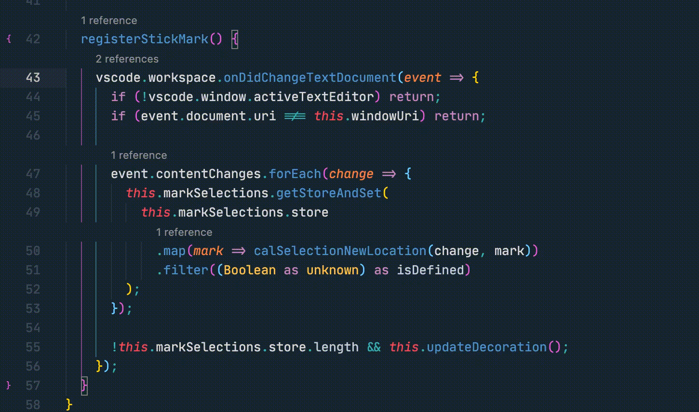

# Sublime Mark

The marking system from Sublime Text.

## Feature

The marking system in Sublime Text is a light version compared to Vim’s, but with two differences:

- There’s only one set of marks at a time. After you assign a new mark, the old one will be gone.
- Marks are volatile. It vanished when the window closed. [#1](#1)

## Todo

- [x] Set Mark
- [x] Swap to Mark
- [x] Support for Multi-Cursor
- [ ] Select to Mark
- [ ] Delete to Mark

## Motivation

In my opinion, this is a mid-range navigation tool. It has a smaller scale than [Bookmark](https://marketplace.visualstudio.com/items?itemName=alefragnani.Bookmarks) and bigger than [Jumpy](https://marketplace.visualstudio.com/items?itemName=wmaurer.vscode-jumpy). The bookmark system could cover the whole project, while Jumpy only covers a few lines. I use this plugin to jump in a single file. It doesn’t have to manage because of the one-set limitation, making it easier to use after a long time of usage.

<a id="1">[#1]</a> The marks will still be there if you directly close Sublime Text and reopen it, but it will disappear after you close the file tab. For now, this version of implementation will always disappear in either way.
